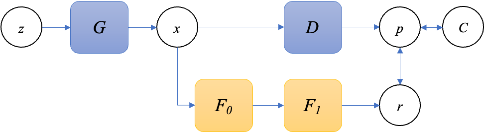
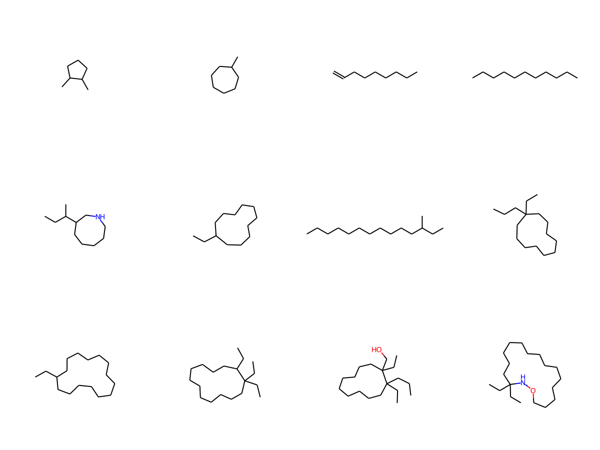
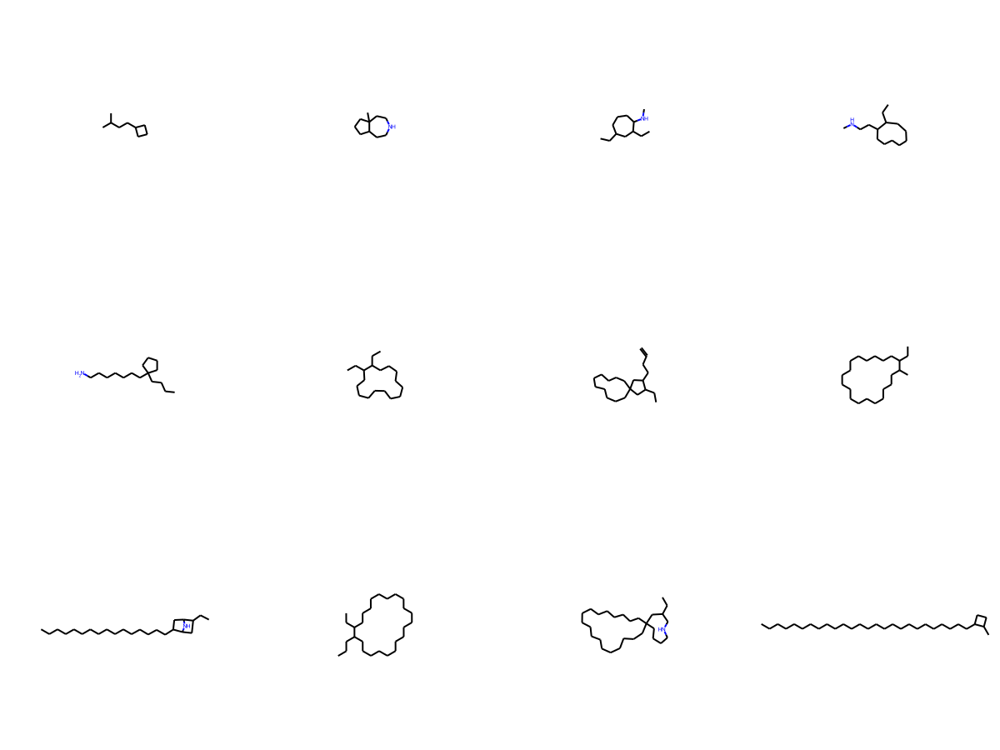

# Directional Generative Networks


## Objective and Motivation
Various methods have been proposed to search for molecules with the desired properties.
  However it remains difficult due to the vastness of the search space.
  Because of the reason, it is not easy to obtain a suitable solution by applying randomized algorithms.
  In recent years, deep learning-based methods have achieved remarkable results in a variety of fields.
  Since most of the methods rely on existing dataset, it is difficult to remove bias derived from the dataset.
  In addition, the annotation cost of preparing new data sets is also significant.
  This study offers some important insights into the scheme of generative models.
  We propose Directional Generative Networks (DGN), molecular candidates finding method using regression model.
  The method is capable of directly generating molecular candidates that satisfy the desired molecular features even in the absence of molecular data sets.

## Training Scheme


## Generated Molecule Examples




## Preparation
Followings have been tested on Ubuntu20.04LTS(x86_64) 
```terminal
$ cd docker/06_conda
$ docker build .
$ docker tag [created image] chem_py38:1.1.0
$ sh run_docker_gpu0.sh
```

In the docker container,
```terminal
$ source ~/.bashrc
$ conda activate rdk_env38
```

## Usage
### training
```terminal
$ cd [project root]
$ sh gen_dgn.sh
```
You are able to change hyper-parameters with editing HyperParams class in ./biz/context_dc.py

## Link
Ito, Yasuaki and Nguyen, Minh Le, Directional Generative Networks. Available at SSRN: https://ssrn.com/abstract=4474512 or http://dx.doi.org/10.2139/ssrn.4474512